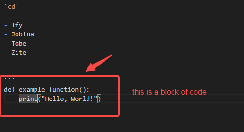

# Documentation-class
## A class to teach ify cloud engineeering documentation

### Simple Steps To Creating An AWS S3 Static Website

**Introduction**

*Introduction*

`cd`

- Ify
- Jobina
- Tobe
- Zite


```
def example_function():
    print("Hello, World!")

```




[aws-restartprogramme](https://www.awsrestartprogram.com/login?ec=302&startURL=%2Fs%2Fplacement)

[aws.com](https://www.awsrestartprogram.com/login?ec=302&startURL=%2Fs%2Fplacement)


